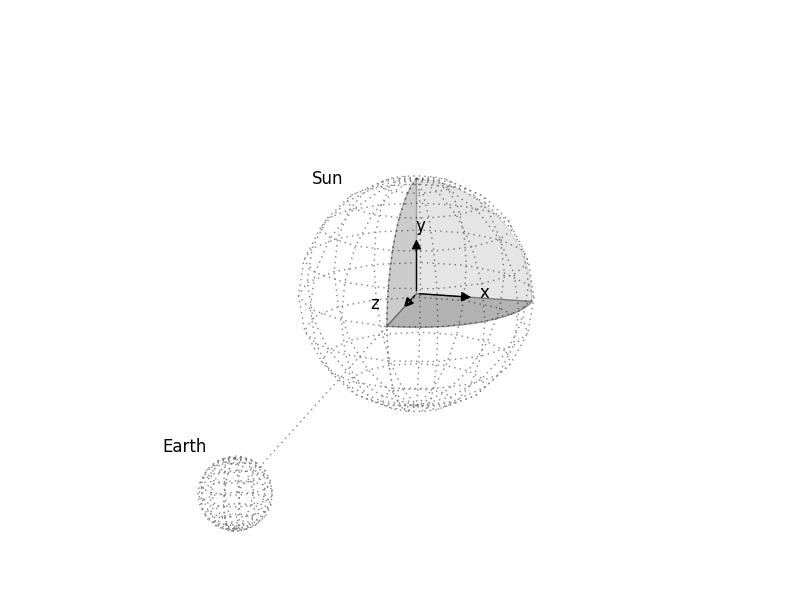
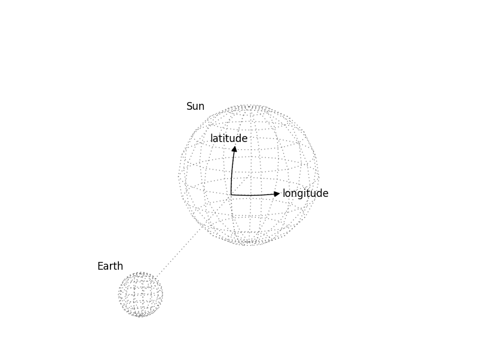

==============================================
Heliophysics coordinate transformation library
==============================================

Changelog
---------
* 09-Dez-2014: Switch API to use <Angle> instead of double for angular values.
* 03-Dez-2014: HPC2HG and HG2HPC
* 02-Dez-2014: Refactor way to pass custom options to converters.
* 28-Nov-2014: HPC2HCC and HCC2HPC
* 26-Nov-2014: HG2HCC and HCC2HG


Overview
--------
This Java library supports transformation between various Heliophysics coordinate systems. It builds on a flexible API 
such that new algorithms can be easily added.

It comes with a couple of unit tests to verify the conversion. 

Most of this library has been ported from Sunpy: http://docs.sunpy.org/en/stable/code_ref/wcs.html.

Sunpy's implementation is based on  Thompson (2006), A&A, 449, 791 http://dx.doi.org/10.1051/0004-6361:20054262
PDF http://fits.gsfc.nasa.gov/wcs/coordinates.pdf


Supported Conversions
---------------------

+---+-------------------------------------------------------+---------------------------------------------------------------+
|   |                                                       |                            To                                 |
+---+-------------------------------------------------------+---+---+---+---+---+---+---+---+---+---+---+---+---+---+---+---+
|   |                                                       | H | H | H |   |   |   |   |   |   |   |   |   |   |   |   |   |
|   |                                                       | G | C | P |   |   |   |   |   |   |   |   |   |   |   |   |   |
|   |                                                       |   | C | C |   |   |   |   |   |   |   |   |   |   |   |   |   |
|   |                                                       |   |   |   |   |   |   |   |   |   |   |   |   |   |   |   |   |
+===+=======================================================+===+===+===+===+===+===+===+===+===+===+===+===+===+===+===+===+
|   | Stonyhurst Heliographic Coordinate (HG)               | x | ✓ | ✓ |   |   |   |   |   |   |   |   |   |   |   |   |   |
+   +-------------------------------------------------------+---+---+---+---+---+---+---+---+---+---+---+---+---+---+---+---+
|   | Heliocentric Cartesian Coordinate (HCC)               | ✓ | x | ✓ |   |   |   |   |   |   |   |   |   |   |   |   |   |
+   +-------------------------------------------------------+---+---+---+---+---+---+---+---+---+---+---+---+---+---+---+---+
|   | Helioprojective-Cartesian Coordinate (HPC)            | ✓ | ✓ | x |   |   |   |   |   |   |   |   |   |   |   |   |   |
+   +-------------------------------------------------------+---+---+---+---+---+---+---+---+---+---+---+---+---+---+---+---+
|   |                                                       |   |   |   | x |   |   |   |   |   |   |   |   |   |   |   |   |
+   +-------------------------------------------------------+---+---+---+---+---+---+---+---+---+---+---+---+---+---+---+---+
|   |                                                       |   |   |   |   | x |   |   |   |   |   |   |   |   |   |   |   |
+   +-------------------------------------------------------+---+---+---+---+---+---+---+---+---+---+---+---+---+---+---+---+
|   |                                                       |   |   |   |   |   | x |   |   |   |   |   |   |   |   |   |   |
+   +-------------------------------------------------------+---+---+---+---+---+---+---+---+---+---+---+---+---+---+---+---+
|   |                                                       |   |   |   |   |   |   | x |   |   |   |   |   |   |   |   |   |
+ F +-------------------------------------------------------+---+---+---+---+---+---+---+---+---+---+---+---+---+---+---+---+
|   |                                                       |   |   |   |   |   |   |   | x |   |   |   |   |   |   |   |   |
+ R +-------------------------------------------------------+---+---+---+---+---+---+---+---+---+---+---+---+---+---+---+---+
|   |                                                       |   |   |   |   |   |   |   |   | x |   |   |   |   |   |   |   |
+ O +-------------------------------------------------------+---+---+---+---+---+---+---+---+---+---+---+---+---+---+---+---+
|   |                                                       |   |   |   |   |   |   |   |   |   | x |   |   |   |   |   |   |
+ M +-------------------------------------------------------+---+---+---+---+---+---+---+---+---+---+---+---+---+---+---+---+
|   |                                                       |   |   |   |   |   |   |   |   |   |   | x |   |   |   |   |   |
+   +-------------------------------------------------------+---+---+---+---+---+---+---+---+---+---+---+---+---+---+---+---+
|   |                                                       |   |   |   |   |   |   |   |   |   |   |   | x |   |   |   |   |
+   +-------------------------------------------------------+---+---+---+---+---+---+---+---+---+---+---+---+---+---+---+---+
|   |                                                       |   |   |   |   |   |   |   |   |   |   |   |   | x |   |   |   |
+   +-------------------------------------------------------+---+---+---+---+---+---+---+---+---+---+---+---+---+---+---+---+
|   |                                                       |   |   |   |   |   |   |   |   |   |   |   |   |   | x |   |   |
+   +-------------------------------------------------------+---+---+---+---+---+---+---+---+---+---+---+---+---+---+---+---+
|   |                                                       |   |   |   |   |   |   |   |   |   |   |   |   |   |   | x |   |
+   +-------------------------------------------------------+---+---+---+---+---+---+---+---+---+---+---+---+---+---+---+---+
|   |                                                       |   |   |   |   |   |   |   |   |   |   |   |   |   |   |   | x |
+---+-------------------------------------------------------+---+---+---+---+---+---+---+---+---+---+---+---+---+---+---+---+

Preconditions
-------------

* Java >1.6

Binaries/Download
-----------------
You can get a compiled version from
http://helio-dev.cs.technik.fhnw.ch/jenkins/job/helio-coordinate-converter/lastStableBuild/ch.fhnw.i4ds.helio$helio-coordinate-converter/

Alternatively you can use Maven to build it yourself.

* Install Maven
* ``git clone https://github.com/marcosoldati/helio-coordinate-converter``
* ``mvn install``


Coordinate Systems
------------------

Heliocentric Coordinates
````````````````````````

Heliocentric coordinates origin in the Sun center. Units are in Meter.



*Figure 1: Visualisation of a Heliocentric Cartesian coordinate system*

Heliographic Coordinates
````````````````````````


*Figure 2: Visualisation of a Heliographic coordinate system*

The Stonyhurst Heliographic coordinate system is relative to the Earth. Its Zero-meridian is at the intersection of the 
Sun's equator and central meridian as seen from the Earth. Longitude raises towards west. Latitude raises towards north. 

The Carrington Heliographic coordinate system is relative to an approximately fixed point on the Sun surface.
The Carrington longitude can be looked up from the 
`astronomical almanac <http://en.wikipedia.org/wiki/Astronomical_Almanac>`_.

The latitude is the same for Carrington and Stonyhurst heliographic coordinate systems.

Usage
-----

Use CoordConverters directly
````````````````````````````

The available converters can be found in package
`ch.fhnw.helio.coordinate.converter <./src/main/java/ch/fhnw/i4ds/helio/coordinate/converter#>`_

::

	CoordConverter converter = new Hcc2HgConverter();
	Map<ConverterOption<?>, Object> opt = converter.getCustomOptions();
	opt.put(ConverterOptions.B0, SAMPLE_B0_IN_RAD);
	opt.put(ConverterOptions.L0, SAMPLE_L0_IN_RAD);
	
	HeliocentricCartesianCoordinate hcc = new HeliocentricCartesianCoordinate(Angle.fromDeg(13.0), Angle.fromDeg(58.0));
	HeliographicCoordinate hg = converter.convert(hcc, opt);
	System.out.println(hcc);
	System.out.println(hg);


Use CoordConverterService
`````````````````````````

Not implemented yet.


Custom extensions
-----------------

TBD
